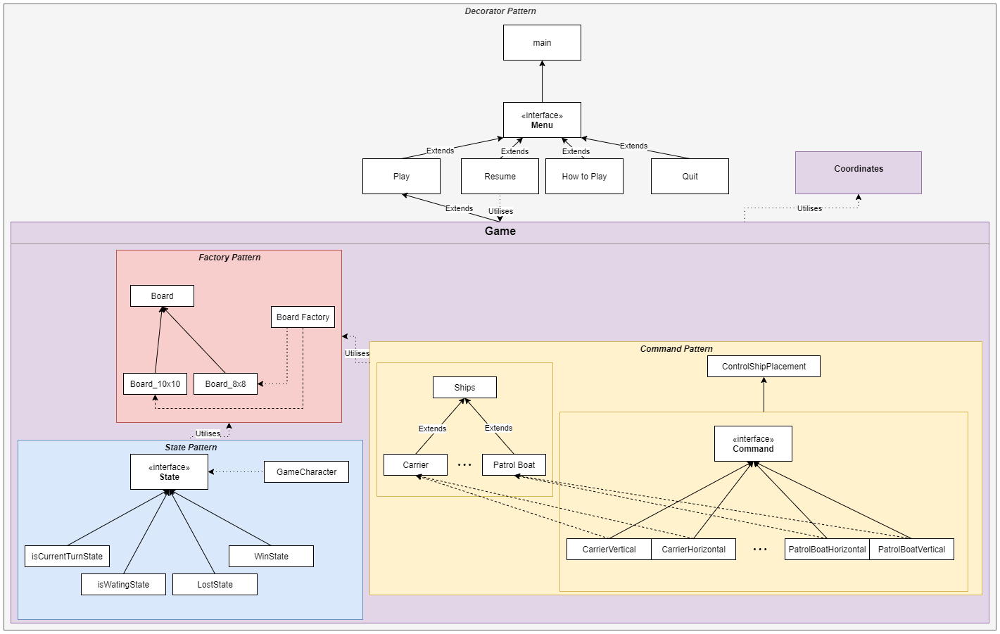

# Battleship
This is a project where I make a Battleship game in Java using four design patterns: Decorator Pattern, Factory Pattern, Command Pattern and State Pattern.
 
***[Download Release](https://github.com/VadimBir/Battleship/releases/tag/v1.0)***
 
### Source code concept 

